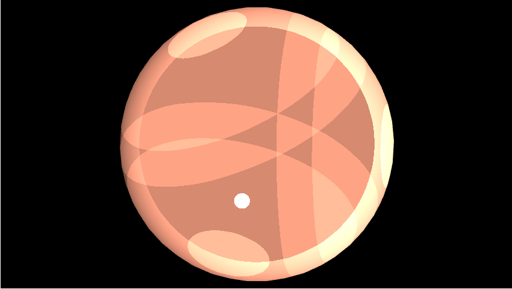

# RenderGPU
Segona pràctica de GiVD 2023-24

## Equip:
**B02**
* Eshaan Mittal (em1ttal)
* Adria Gasull Rectoret (Grillooo)
* Daniel Gonzalez Braza (lilDaniG)
* Paula Bezares Cano (pbeza02)
    
**Abstract**

Este proyecto explora la implementación de shaders en OpenGL, específicamente un vertex shader y un fragment shader, para aprender a usar ZBuffer y el GPU. El vertex shader se encarga de transformar y preparar los vértices del modelo, mientras que el fragment shader aplica efectos visuales avanzados, incluyendo texturizado e iluminación. Hemos trabajado en pasos para poder entender bien como funciona la renderización con el GPU, como pasar los valores y como implementar los pares de vertex-fragment sahders. Finalmente, hemos hehco dos ejercicios para combinar todo lo que hemos aporendido y crear dos escenas finales.

**Features**

- Fase 1
    - Material (no cal adjuntar captures de pantalla)
        - [X] 
          - Eshaan Mittal, Paula Bezares
    - Light (no cal adjuntar captures de pantalla)
        - [X] Puntual
          - Eshaan Mittal, Paula Bezares
        - [ ] Direccional
        - [ ] Spotlight
        - [x] Ambient Global
          - Eshaan Mittal, Paula Bezares
    - Shading
        - [x] Normal
           - Adrià Gasull, Eshaan Mittal
        - [x] Phong
           - Adrià Gasull, Eshaan Mittal
        - [x] Gouraud
           - Adrià Gasull, Eshaan Mittal
        - [x] Toon-shading
           - Adrià Gasull, Eshaan Mittal
    - Textures
        - [x] Textura com material en un objecte
           - Eshaan Mittal

- Fase 2 
    - [x] Exercici 1
       - Eshaan Mittal, Paula Bezares
    - [x] Exercici 2
       - Eshaan Mittal, Adria Gasull

- Opcionals
    - [ ] Èmfasi de siluetes
    - [ ] Mapping indirecte de textures
    - [ ] Animacions amb dades temporals
    - [ ] Entorn amb textures
    - [ ] Reflexions
    - [ ] Transparències via objectes.
    - [ ] Transparències via environmental mapping.

**Extensions**
 - Botón para Agregar Textura
   
Implementamos un botón en el GUI que deja al usuario elegir la textura que quiere cargar.

 - Botón para Limpiar Pantalla
   
Implementamos un botón en el GUI que borra todos los objetos que están presenetes en la pantalla.

**Memòria**

1. **Paso de Valores a GPU**
   
Primero navegamos por el código para comprender adecuadamente su estructura y aprender dónde está cada cosa, facilitando nuestro trabajo en el futuro. En los pasos iniciales, aprendimos cómo pasar valores a la GPU y cómo usar estructuras y matrices en la GPU, permitiendo más de una luz. Un problema que encontramos era que la funcion glUniformXXX siempre daba el error de que no existia, lo cual nos resultaba raro, ya que se usaba en el tutorial. Lo que nos faltaba era un import que no nos habiamos dado cuenta.

2. **Shaders**:
   
La implementación de los shaders fue un proceso algo complicado. Los algoritmos en si de cada shader eran bastante simples ya que ya habíamos implementado todo en la primera práctica. Las complicaciones surgieron a la hora de considerar si el código debía estar en el fragment shader o en el vertex shader, algo que en ocasiones no quedaba claro. Por ejemplo, la diferencia entre blinn-phong y gouraud blinn-phong es simplemente si el código está en el vShader o en el fShader. Además, dependiendo de las luces utilizadas y del objeto utilizado, la diferencia en la salida de la imagen es casi imposible de percibir.

3. **Textures**

La implementación de texturas fue un proceso más simple ya que ahora estábamos más familiarizados con el código. El único problema que tuvimos durante este proceso fue que estabamos usando mal el buffer durante ejercicios anteriores. Habíamos comenzado a usar una combinación de diferentes layouts para pasar el vPosition, vColor y vNormal, lo que comenzó a causar que el resultado fuera muy diferente de lo que esperábamos. Una vez que arreglamos el orden del búfer y agregamos las compensaciones correctas, añadiendo las texturas, todo funcionó bien. Aquí también implementamos un paso adicional que estan explicadas arriba.

4. **Exercises**

Los ejercicios fueron más sencillos de implementar ya que son solo combinaciones de sombreadores anteriores. La nueva característica que aprendimos a usar es QTimer y cómo se puede usar para hacer animaciones. Durante el proceso de implementar los ejercicios, implementamos dos funcionalidades nuevas que estan explicadas arriba.

5. **Preguntas Fase 2**

    1. Detalla on es faria el càlcul del cercle visible. Amb quines coordenades? Amb coordenades de món? De càmera? O de viewport?
       
      En nuestra implementación, lo calculamos con coordenadas de mundo. Calculamos la distania desde el origen del mundo hasta el punto para ver si el pixel que vamos a pintar esta adento o afuera del circulo.

    2.  Ara anima la textura visible en el cercle, variant les coordenades de textures amb segons un temps t i una velocitat. On faràs el càlcul?

      El calculo de la textura esta hecho en el vShader con la linea de codigo:

        texture_mesh = vTexture + vec2(time*time, time*time);
   Esta línea cambia las coordenadas de la textura dependiendo del tiempo para realizar la animación.

   Los métodos utilizados en estas preguntas son más o menos iguales para la implementación del ejercicio 2.

**Screenshots**

* **Tutorial 2**:
* Fase 1:
  
      · Normal Shading:
    

        </img>
    

    
      · Color Shading:
    

        </img>
    

  
      · Gouraud Shading:
    

        </img>
    

    Valores de luz y material dados en el fichero de "Escena test + Fotos"
  
      · Phong Shading:
    

        </img>
    

    Valores de luz y material dados en el fichero de "Escena test + Fotos"
    
      · Cel/Toon Shading:
  
    - Material: Ka: (0.2, 0.2, 0.2), Kd: (0.8, 0.5, 0.4), Ks: (1.0, 1.0, 1.0)
    - Light: Ia: (0.2, 0.2, 0.2), Id: (0.8, 0.8, 0.8), Is: (1.0, 1.0, 1.0), a = 0.5, b= 0.0, c= 0.01
      - Position 1: (10, 10, 20)
      - Position 2: (-10, -4, 5)
      - Position 3: (24, -36, -18.3)
    

        </img>
    

      · Textures Example 1:
  MonkeyTex.obj image and MonkeyTex.png texture
    

        </img>
    

      · Textures Example 2:
  capsule.obj and 2k_sun.jpg texture
    

        </img>
    

    
* Fase 2:
  
      · Exercici 1 Visió circular de textura animada:
    

        </img>
    

    
      · Exercici 2 Reversionant la tempesta de Fornite:
    

        </img>
    

    
**Additional Information**

Horas dedicadas en total: Todas las horas de clase de lab, y ~10 horas semanales fuera de clase.
